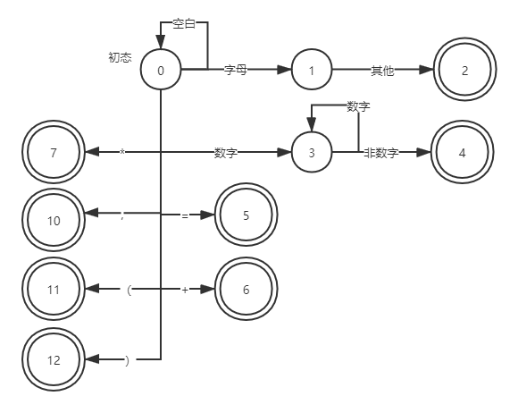

# 词法分析部分

词法分析部分将从左向右逐行扫描源程序的字符，识别出各个单词，确定单词的类型。将识别出的单词转换成统一的键值对表示——词法单元（token）形式。

## 1 构造C语言的子集
### 关键字
一共统计了32个关键字，按首字母顺序排列如下：
```
auto       break    case     char        const      continue  
default    do       double   else        enum       extern    
float      for      goto     if          int        long      
register   return   short    signed      sizeof     static  
struct     switch   typedef  union       unsigned   void  
volatile   while
```
我们为每一个关键词分配一个种别码，一词一码。

### 标识符
变量名、数组名、记录名、过程名等，为简化问题，不考虑变量名中含有下划线。变量名的正则定义为
``` r
letter (digit | letter)*
```
将所有标识符作为同一类单词，分配同一个种别码，多词一码。为了区分不同的标识符，用token的第二个分量属性值来存放不同标识符的字面值。

### 常量
为简化问题，只实现整型常量的词法分析。为整型常量分配一个种别码，用token的第二个分量存放不同常量的具体值。整数的正则定义为
``` r
digit digit*
```

### 运算符和界限符
为简化问题，运算符和界限符统一按照一词一码规则分配种别码。

分配种别码如下：

<table class="MsoNormalTable" border="1" cellspacing="0" cellpadding="0" width="545" style="margin-left:7.0pt;border-collapse:collapse;border:none">
 <tbody><tr style="height:4.5pt">
  <td width="142" valign="top" style="width:106.8pt;border:solid windowtext 1.0pt;
  padding:0cm 5.4pt 0cm 5.4pt;height:4.5pt">
  <p class="MsoNormal" style="text-indent:22.0pt"><span style="font-size:11.0pt;
  font-family:&quot;微软雅黑&quot;,sans-serif">单词符号</span></p>
  </td>
  <td width="134" valign="top" style="width:100.5pt;border:solid windowtext 1.0pt;
  border-left:none;padding:0cm 5.4pt 0cm 5.4pt;height:4.5pt">
  <p class="MsoNormal"><span style="font-size:11.0pt;font-family:&quot;微软雅黑&quot;,sans-serif">种别码
  </span></p>
  </td>
  <td width="147" valign="top" style="width:110.05pt;border:solid windowtext 1.0pt;
  border-left:none;padding:0cm 5.4pt 0cm 5.4pt;height:4.5pt">
  <p class="MsoNormal"><span style="font-size:11.0pt;font-family:&quot;微软雅黑&quot;,sans-serif">单词符号</span></p>
  </td>
  <td width="121" valign="top" style="width:91.05pt;border:solid windowtext 1.0pt;
  border-left:none;padding:0cm 5.4pt 0cm 5.4pt;height:4.5pt">
  <p class="MsoNormal"><span style="font-size:11.0pt;font-family:&quot;微软雅黑&quot;,sans-serif">种别码</span></p>
  </td>
 </tr>
 <tr style="height:15.95pt">
  <td width="142" valign="top" style="width:106.8pt;border:solid windowtext 1.0pt;
  border-top:none;padding:0cm 5.4pt 0cm 5.4pt;height:15.95pt">
  <p class="MsoNormal"><span lang="EN-US" style="font-size:11.0pt;font-family:&quot;微软雅黑&quot;,sans-serif">auto</span></p>
  </td>
  <td width="134" valign="top" style="width:100.5pt;border-top:none;border-left:
  none;border-bottom:solid windowtext 1.0pt;border-right:solid windowtext 1.0pt;
  padding:0cm 5.4pt 0cm 5.4pt;height:15.95pt">
  <p class="MsoNormal"><span lang="EN-US" style="font-size:11.0pt;font-family:&quot;微软雅黑&quot;,sans-serif">1</span></p>
  </td>
  <td width="147" valign="top" style="width:110.05pt;border-top:none;border-left:
  none;border-bottom:solid windowtext 1.0pt;border-right:solid windowtext 1.0pt;
  padding:0cm 5.4pt 0cm 5.4pt;height:15.95pt">
  <p class="MsoNormal"><span lang="EN-US" style="font-size:11.0pt;font-family:&quot;微软雅黑&quot;,sans-serif">&lt;&nbsp;</span></p>
  </td>
  <td width="121" valign="top" style="width:91.05pt;border-top:none;border-left:
  none;border-bottom:solid windowtext 1.0pt;border-right:solid windowtext 1.0pt;
  padding:0cm 5.4pt 0cm 5.4pt;height:15.95pt">
  <p class="MsoNormal"><span lang="EN-US" style="font-size:11.0pt;font-family:&quot;微软雅黑&quot;,sans-serif">37</span></p>
  </td>
 </tr>
 <tr style="height:15.95pt">
  <td width="142" valign="top" style="width:106.8pt;border:solid windowtext 1.0pt;
  border-top:none;padding:0cm 5.4pt 0cm 5.4pt;height:15.95pt">
  <p class="MsoNormal"><span lang="EN-US" style="font-size:11.0pt;font-family:&quot;微软雅黑&quot;,sans-serif">break</span></p>
  </td>
  <td width="134" valign="top" style="width:100.5pt;border-top:none;border-left:
  none;border-bottom:solid windowtext 1.0pt;border-right:solid windowtext 1.0pt;
  padding:0cm 5.4pt 0cm 5.4pt;height:15.95pt">
  <p class="MsoNormal"><span lang="EN-US" style="font-size:11.0pt;font-family:&quot;微软雅黑&quot;,sans-serif">2</span></p>
  </td>
  <td width="147" valign="top" style="width:110.05pt;border-top:none;border-left:
  none;border-bottom:solid windowtext 1.0pt;border-right:solid windowtext 1.0pt;
  padding:0cm 5.4pt 0cm 5.4pt;height:15.95pt">
  <p class="MsoNormal"><span lang="EN-US" style="font-size:11.0pt;font-family:&quot;微软雅黑&quot;,sans-serif">&lt;=</span></p>
  </td>
  <td width="121" valign="top" style="width:91.05pt;border-top:none;border-left:
  none;border-bottom:solid windowtext 1.0pt;border-right:solid windowtext 1.0pt;
  padding:0cm 5.4pt 0cm 5.4pt;height:15.95pt">
  <p class="MsoNormal"><span lang="EN-US" style="font-size:11.0pt;font-family:&quot;微软雅黑&quot;,sans-serif">38</span></p>
  </td>
 </tr>
 <tr style="height:15.95pt">
  <td width="142" valign="top" style="width:106.8pt;border:solid windowtext 1.0pt;
  border-top:none;padding:0cm 5.4pt 0cm 5.4pt;height:15.95pt">
  <p class="MsoNormal"><span lang="EN-US" style="font-size:11.0pt;font-family:&quot;微软雅黑&quot;,sans-serif">case</span></p>
  </td>
  <td width="134" valign="top" style="width:100.5pt;border-top:none;border-left:
  none;border-bottom:solid windowtext 1.0pt;border-right:solid windowtext 1.0pt;
  padding:0cm 5.4pt 0cm 5.4pt;height:15.95pt">
  <p class="MsoNormal"><span lang="EN-US" style="font-size:11.0pt;font-family:&quot;微软雅黑&quot;,sans-serif">3</span></p>
  </td>
  <td width="147" valign="top" style="width:110.05pt;border-top:none;border-left:
  none;border-bottom:solid windowtext 1.0pt;border-right:solid windowtext 1.0pt;
  padding:0cm 5.4pt 0cm 5.4pt;height:15.95pt">
  <p class="MsoNormal"><span lang="EN-US" style="font-size:11.0pt;font-family:&quot;微软雅黑&quot;,sans-serif">&gt;&nbsp;</span></p>
  </td>
  <td width="121" valign="top" style="width:91.05pt;border-top:none;border-left:
  none;border-bottom:solid windowtext 1.0pt;border-right:solid windowtext 1.0pt;
  padding:0cm 5.4pt 0cm 5.4pt;height:15.95pt">
  <p class="MsoNormal"><span lang="EN-US" style="font-size:11.0pt;font-family:&quot;微软雅黑&quot;,sans-serif">39</span></p>
  </td>
 </tr>
 <tr style="height:15.95pt">
  <td width="142" valign="top" style="width:106.8pt;border:solid windowtext 1.0pt;
  border-top:none;padding:0cm 5.4pt 0cm 5.4pt;height:15.95pt">
  <p class="MsoNormal"><span lang="EN-US" style="font-size:11.0pt;font-family:&quot;微软雅黑&quot;,sans-serif">char</span></p>
  </td>
  <td width="134" valign="top" style="width:100.5pt;border-top:none;border-left:
  none;border-bottom:solid windowtext 1.0pt;border-right:solid windowtext 1.0pt;
  padding:0cm 5.4pt 0cm 5.4pt;height:15.95pt">
  <p class="MsoNormal"><span lang="EN-US" style="font-size:11.0pt;font-family:&quot;微软雅黑&quot;,sans-serif">4</span></p>
  </td>
  <td width="147" valign="top" style="width:110.05pt;border-top:none;border-left:
  none;border-bottom:solid windowtext 1.0pt;border-right:solid windowtext 1.0pt;
  padding:0cm 5.4pt 0cm 5.4pt;height:15.95pt">
  <p class="MsoNormal"><span lang="EN-US" style="font-size:11.0pt;font-family:&quot;微软雅黑&quot;,sans-serif">&gt;=</span></p>
  </td>
  <td width="121" valign="top" style="width:91.05pt;border-top:none;border-left:
  none;border-bottom:solid windowtext 1.0pt;border-right:solid windowtext 1.0pt;
  padding:0cm 5.4pt 0cm 5.4pt;height:15.95pt">
  <p class="MsoNormal"><span lang="EN-US" style="font-size:11.0pt;font-family:&quot;微软雅黑&quot;,sans-serif">40</span></p>
  </td>
 </tr>
 <tr style="height:15.95pt">
  <td width="142" valign="top" style="width:106.8pt;border:solid windowtext 1.0pt;
  border-top:none;padding:0cm 5.4pt 0cm 5.4pt;height:15.95pt">
  <p class="MsoNormal"><span lang="EN-US" style="font-size:11.0pt;font-family:&quot;微软雅黑&quot;,sans-serif">const</span></p>
  </td>
  <td width="134" valign="top" style="width:100.5pt;border-top:none;border-left:
  none;border-bottom:solid windowtext 1.0pt;border-right:solid windowtext 1.0pt;
  padding:0cm 5.4pt 0cm 5.4pt;height:15.95pt">
  <p class="MsoNormal"><span lang="EN-US" style="font-size:11.0pt;font-family:&quot;微软雅黑&quot;,sans-serif">5</span></p>
  </td>
  <td width="147" valign="top" style="width:110.05pt;border-top:none;border-left:
  none;border-bottom:solid windowtext 1.0pt;border-right:solid windowtext 1.0pt;
  padding:0cm 5.4pt 0cm 5.4pt;height:15.95pt">
  <p class="MsoNormal"><span lang="EN-US" style="font-size:11.0pt;font-family:&quot;微软雅黑&quot;,sans-serif">=</span></p>
  </td>
  <td width="121" valign="top" style="width:91.05pt;border-top:none;border-left:
  none;border-bottom:solid windowtext 1.0pt;border-right:solid windowtext 1.0pt;
  padding:0cm 5.4pt 0cm 5.4pt;height:15.95pt">
  <p class="MsoNormal"><span lang="EN-US" style="font-size:11.0pt;font-family:&quot;微软雅黑&quot;,sans-serif">41</span></p>
  </td>
 </tr>
 <tr style="height:15.95pt">
  <td width="142" valign="top" style="width:106.8pt;border:solid windowtext 1.0pt;
  border-top:none;padding:0cm 5.4pt 0cm 5.4pt;height:15.95pt">
  <p class="MsoNormal"><span lang="EN-US" style="font-size:11.0pt;font-family:&quot;微软雅黑&quot;,sans-serif">continue</span></p>
  </td>
  <td width="134" valign="top" style="width:100.5pt;border-top:none;border-left:
  none;border-bottom:solid windowtext 1.0pt;border-right:solid windowtext 1.0pt;
  padding:0cm 5.4pt 0cm 5.4pt;height:15.95pt">
  <p class="MsoNormal"><span lang="EN-US" style="font-size:11.0pt;font-family:&quot;微软雅黑&quot;,sans-serif">6</span></p>
  </td>
  <td width="147" valign="top" style="width:110.05pt;border-top:none;border-left:
  none;border-bottom:solid windowtext 1.0pt;border-right:solid windowtext 1.0pt;
  padding:0cm 5.4pt 0cm 5.4pt;height:15.95pt">
  <p class="MsoNormal"><span lang="EN-US" style="font-size:11.0pt;font-family:&quot;微软雅黑&quot;,sans-serif">==</span></p>
  </td>
  <td width="121" valign="top" style="width:91.05pt;border-top:none;border-left:
  none;border-bottom:solid windowtext 1.0pt;border-right:solid windowtext 1.0pt;
  padding:0cm 5.4pt 0cm 5.4pt;height:15.95pt">
  <p class="MsoNormal"><span lang="EN-US" style="font-size:11.0pt;font-family:&quot;微软雅黑&quot;,sans-serif">42</span></p>
  </td>
 </tr>
 <tr style="height:15.95pt">
  <td width="142" valign="top" style="width:106.8pt;border:solid windowtext 1.0pt;
  border-top:none;padding:0cm 5.4pt 0cm 5.4pt;height:15.95pt">
  <p class="MsoNormal"><span lang="EN-US" style="font-size:11.0pt;font-family:&quot;微软雅黑&quot;,sans-serif">default</span></p>
  </td>
  <td width="134" valign="top" style="width:100.5pt;border-top:none;border-left:
  none;border-bottom:solid windowtext 1.0pt;border-right:solid windowtext 1.0pt;
  padding:0cm 5.4pt 0cm 5.4pt;height:15.95pt">
  <p class="MsoNormal"><span lang="EN-US" style="font-size:11.0pt;font-family:&quot;微软雅黑&quot;,sans-serif">7</span></p>
  </td>
  <td width="147" valign="top" style="width:110.05pt;border-top:none;border-left:
  none;border-bottom:solid windowtext 1.0pt;border-right:solid windowtext 1.0pt;
  padding:0cm 5.4pt 0cm 5.4pt;height:15.95pt">
  <p class="MsoNormal"><span lang="EN-US" style="font-size:11.0pt;font-family:&quot;微软雅黑&quot;,sans-serif">!=</span></p>
  </td>
  <td width="121" valign="top" style="width:91.05pt;border-top:none;border-left:
  none;border-bottom:solid windowtext 1.0pt;border-right:solid windowtext 1.0pt;
  padding:0cm 5.4pt 0cm 5.4pt;height:15.95pt">
  <p class="MsoNormal"><span lang="EN-US" style="font-size:11.0pt;font-family:&quot;微软雅黑&quot;,sans-serif">43</span></p>
  </td>
 </tr>
 <tr style="height:15.95pt">
  <td width="142" valign="top" style="width:106.8pt;border:solid windowtext 1.0pt;
  border-top:none;padding:0cm 5.4pt 0cm 5.4pt;height:15.95pt">
  <p class="MsoNormal"><span lang="EN-US" style="font-size:11.0pt;font-family:&quot;微软雅黑&quot;,sans-serif">do</span></p>
  </td>
  <td width="134" valign="top" style="width:100.5pt;border-top:none;border-left:
  none;border-bottom:solid windowtext 1.0pt;border-right:solid windowtext 1.0pt;
  padding:0cm 5.4pt 0cm 5.4pt;height:15.95pt">
  <p class="MsoNormal"><span lang="EN-US" style="font-size:11.0pt;font-family:&quot;微软雅黑&quot;,sans-serif">8</span></p>
  </td>
  <td width="147" valign="top" style="width:110.05pt;border-top:none;border-left:
  none;border-bottom:solid windowtext 1.0pt;border-right:solid windowtext 1.0pt;
  padding:0cm 5.4pt 0cm 5.4pt;height:15.95pt">
  <p class="MsoNormal"><span lang="EN-US" style="font-size:11.0pt;font-family:&quot;微软雅黑&quot;,sans-serif">;</span></p>
  </td>
  <td width="121" valign="top" style="width:91.05pt;border-top:none;border-left:
  none;border-bottom:solid windowtext 1.0pt;border-right:solid windowtext 1.0pt;
  padding:0cm 5.4pt 0cm 5.4pt;height:15.95pt">
  <p class="MsoNormal"><span lang="EN-US" style="font-size:11.0pt;font-family:&quot;微软雅黑&quot;,sans-serif">44</span></p>
  </td>
 </tr>
 <tr style="height:15.95pt">
  <td width="142" valign="top" style="width:106.8pt;border:solid windowtext 1.0pt;
  border-top:none;padding:0cm 5.4pt 0cm 5.4pt;height:15.95pt">
  <p class="MsoNormal"><span lang="EN-US" style="font-size:11.0pt;font-family:&quot;微软雅黑&quot;,sans-serif">double</span></p>
  </td>
  <td width="134" valign="top" style="width:100.5pt;border-top:none;border-left:
  none;border-bottom:solid windowtext 1.0pt;border-right:solid windowtext 1.0pt;
  padding:0cm 5.4pt 0cm 5.4pt;height:15.95pt">
  <p class="MsoNormal"><span lang="EN-US" style="font-size:11.0pt;font-family:&quot;微软雅黑&quot;,sans-serif">9</span></p>
  </td>
  <td width="147" valign="top" style="width:110.05pt;border-top:none;border-left:
  none;border-bottom:solid windowtext 1.0pt;border-right:solid windowtext 1.0pt;
  padding:0cm 5.4pt 0cm 5.4pt;height:15.95pt">
  <p class="MsoNormal"><span lang="EN-US" style="font-size:11.0pt;font-family:&quot;微软雅黑&quot;,sans-serif">(</span></p>
  </td>
  <td width="121" valign="top" style="width:91.05pt;border-top:none;border-left:
  none;border-bottom:solid windowtext 1.0pt;border-right:solid windowtext 1.0pt;
  padding:0cm 5.4pt 0cm 5.4pt;height:15.95pt">
  <p class="MsoNormal"><span lang="EN-US" style="font-size:11.0pt;font-family:&quot;微软雅黑&quot;,sans-serif">45</span></p>
  </td>
 </tr>
 <tr style="height:15.95pt">
  <td width="142" valign="top" style="width:106.8pt;border:solid windowtext 1.0pt;
  border-top:none;padding:0cm 5.4pt 0cm 5.4pt;height:15.95pt">
  <p class="MsoNormal"><span lang="EN-US" style="font-size:11.0pt;font-family:&quot;微软雅黑&quot;,sans-serif">else</span></p>
  </td>
  <td width="134" valign="top" style="width:100.5pt;border-top:none;border-left:
  none;border-bottom:solid windowtext 1.0pt;border-right:solid windowtext 1.0pt;
  padding:0cm 5.4pt 0cm 5.4pt;height:15.95pt">
  <p class="MsoNormal"><span lang="EN-US" style="font-size:11.0pt;font-family:&quot;微软雅黑&quot;,sans-serif">10</span></p>
  </td>
  <td width="147" valign="top" style="width:110.05pt;border-top:none;border-left:
  none;border-bottom:solid windowtext 1.0pt;border-right:solid windowtext 1.0pt;
  padding:0cm 5.4pt 0cm 5.4pt;height:15.95pt">
  <p class="MsoNormal"><span lang="EN-US" style="font-size:11.0pt;font-family:&quot;微软雅黑&quot;,sans-serif">)</span></p>
  </td>
  <td width="121" valign="top" style="width:91.05pt;border-top:none;border-left:
  none;border-bottom:solid windowtext 1.0pt;border-right:solid windowtext 1.0pt;
  padding:0cm 5.4pt 0cm 5.4pt;height:15.95pt">
  <p class="MsoNormal"><span lang="EN-US" style="font-size:11.0pt;font-family:&quot;微软雅黑&quot;,sans-serif">46</span></p>
  </td>
 </tr>
 <tr style="height:15.95pt">
  <td width="142" valign="top" style="width:106.8pt;border:solid windowtext 1.0pt;
  border-top:none;padding:0cm 5.4pt 0cm 5.4pt;height:15.95pt">
  <p class="MsoNormal"><span lang="EN-US" style="font-size:11.0pt;font-family:&quot;微软雅黑&quot;,sans-serif">enum</span></p>
  </td>
  <td width="134" valign="top" style="width:100.5pt;border-top:none;border-left:
  none;border-bottom:solid windowtext 1.0pt;border-right:solid windowtext 1.0pt;
  padding:0cm 5.4pt 0cm 5.4pt;height:15.95pt">
  <p class="MsoNormal"><span lang="EN-US" style="font-size:11.0pt;font-family:&quot;微软雅黑&quot;,sans-serif">11</span></p>
  </td>
  <td width="147" valign="top" style="width:110.05pt;border-top:none;border-left:
  none;border-bottom:solid windowtext 1.0pt;border-right:solid windowtext 1.0pt;
  padding:0cm 5.4pt 0cm 5.4pt;height:15.95pt">
  <p class="MsoNormal"><span lang="EN-US" style="font-size:11.0pt;font-family:&quot;微软雅黑&quot;,sans-serif">^</span></p>
  </td>
  <td width="121" valign="top" style="width:91.05pt;border-top:none;border-left:
  none;border-bottom:solid windowtext 1.0pt;border-right:solid windowtext 1.0pt;
  padding:0cm 5.4pt 0cm 5.4pt;height:15.95pt">
  <p class="MsoNormal"><span lang="EN-US" style="font-size:11.0pt;font-family:&quot;微软雅黑&quot;,sans-serif">47</span></p>
  </td>
 </tr>
 <tr style="height:15.95pt">
  <td width="142" valign="top" style="width:106.8pt;border:solid windowtext 1.0pt;
  border-top:none;padding:0cm 5.4pt 0cm 5.4pt;height:15.95pt">
  <p class="MsoNormal"><span lang="EN-US" style="font-size:11.0pt;font-family:&quot;微软雅黑&quot;,sans-serif">extern</span></p>
  </td>
  <td width="134" valign="top" style="width:100.5pt;border-top:none;border-left:
  none;border-bottom:solid windowtext 1.0pt;border-right:solid windowtext 1.0pt;
  padding:0cm 5.4pt 0cm 5.4pt;height:15.95pt">
  <p class="MsoNormal"><span lang="EN-US" style="font-size:11.0pt;font-family:&quot;微软雅黑&quot;,sans-serif">12</span></p>
  </td>
  <td width="147" valign="top" style="width:110.05pt;border-top:none;border-left:
  none;border-bottom:solid windowtext 1.0pt;border-right:solid windowtext 1.0pt;
  padding:0cm 5.4pt 0cm 5.4pt;height:15.95pt">
  <p class="MsoNormal"><span lang="EN-US" style="font-size:11.0pt;font-family:&quot;微软雅黑&quot;,sans-serif">,</span></p>
  </td>
  <td width="121" valign="top" style="width:91.05pt;border-top:none;border-left:
  none;border-bottom:solid windowtext 1.0pt;border-right:solid windowtext 1.0pt;
  padding:0cm 5.4pt 0cm 5.4pt;height:15.95pt">
  <p class="MsoNormal"><span lang="EN-US" style="font-size:11.0pt;font-family:&quot;微软雅黑&quot;,sans-serif">48</span></p>
  </td>
 </tr>
 <tr style="height:15.95pt">
  <td width="142" valign="top" style="width:106.8pt;border:solid windowtext 1.0pt;
  border-top:none;padding:0cm 5.4pt 0cm 5.4pt;height:15.95pt">
  <p class="MsoNormal"><span lang="EN-US" style="font-size:11.0pt;font-family:&quot;微软雅黑&quot;,sans-serif">float
  </span></p>
  </td>
  <td width="134" valign="top" style="width:100.5pt;border-top:none;border-left:
  none;border-bottom:solid windowtext 1.0pt;border-right:solid windowtext 1.0pt;
  padding:0cm 5.4pt 0cm 5.4pt;height:15.95pt">
  <p class="MsoNormal"><span lang="EN-US" style="font-size:11.0pt;font-family:&quot;微软雅黑&quot;,sans-serif">13</span></p>
  </td>
  <td width="147" valign="top" style="width:110.05pt;border-top:none;border-left:
  none;border-bottom:solid windowtext 1.0pt;border-right:solid windowtext 1.0pt;
  padding:0cm 5.4pt 0cm 5.4pt;height:15.95pt">
  <p class="MsoNormal"><span lang="EN-US" style="font-size:11.0pt;font-family:&quot;微软雅黑&quot;,sans-serif">“</span></p>
  </td>
  <td width="121" valign="top" style="width:91.05pt;border-top:none;border-left:
  none;border-bottom:solid windowtext 1.0pt;border-right:solid windowtext 1.0pt;
  padding:0cm 5.4pt 0cm 5.4pt;height:15.95pt">
  <p class="MsoNormal"><span lang="EN-US" style="font-size:11.0pt;font-family:&quot;微软雅黑&quot;,sans-serif">49</span></p>
  </td>
 </tr>
 <tr style="height:15.95pt">
  <td width="142" valign="top" style="width:106.8pt;border:solid windowtext 1.0pt;
  border-top:none;padding:0cm 5.4pt 0cm 5.4pt;height:15.95pt">
  <p class="MsoNormal"><span lang="EN-US" style="font-size:11.0pt;font-family:&quot;微软雅黑&quot;,sans-serif">for</span></p>
  </td>
  <td width="134" valign="top" style="width:100.5pt;border-top:none;border-left:
  none;border-bottom:solid windowtext 1.0pt;border-right:solid windowtext 1.0pt;
  padding:0cm 5.4pt 0cm 5.4pt;height:15.95pt">
  <p class="MsoNormal"><span lang="EN-US" style="font-size:11.0pt;font-family:&quot;微软雅黑&quot;,sans-serif">14</span></p>
  </td>
  <td width="147" valign="top" style="width:110.05pt;border-top:none;border-left:
  none;border-bottom:solid windowtext 1.0pt;border-right:solid windowtext 1.0pt;
  padding:0cm 5.4pt 0cm 5.4pt;height:15.95pt">
  <p class="MsoNormal"><span lang="EN-US" style="font-size:11.0pt;font-family:&quot;微软雅黑&quot;,sans-serif">‘</span></p>
  </td>
  <td width="121" valign="top" style="width:91.05pt;border-top:none;border-left:
  none;border-bottom:solid windowtext 1.0pt;border-right:solid windowtext 1.0pt;
  padding:0cm 5.4pt 0cm 5.4pt;height:15.95pt">
  <p class="MsoNormal"><span lang="EN-US" style="font-size:11.0pt;font-family:&quot;微软雅黑&quot;,sans-serif">50</span></p>
  </td>
 </tr>
 <tr style="height:15.95pt">
  <td width="142" valign="top" style="width:106.8pt;border:solid windowtext 1.0pt;
  border-top:none;padding:0cm 5.4pt 0cm 5.4pt;height:15.95pt">
  <p class="MsoNormal"><span lang="EN-US" style="font-size:11.0pt;font-family:&quot;微软雅黑&quot;,sans-serif">goto</span></p>
  </td>
  <td width="134" valign="top" style="width:100.5pt;border-top:none;border-left:
  none;border-bottom:solid windowtext 1.0pt;border-right:solid windowtext 1.0pt;
  padding:0cm 5.4pt 0cm 5.4pt;height:15.95pt">
  <p class="MsoNormal"><span lang="EN-US" style="font-size:11.0pt;font-family:&quot;微软雅黑&quot;,sans-serif">15</span></p>
  </td>
  <td width="147" valign="top" style="width:110.05pt;border-top:none;border-left:
  none;border-bottom:solid windowtext 1.0pt;border-right:solid windowtext 1.0pt;
  padding:0cm 5.4pt 0cm 5.4pt;height:15.95pt">
  <p class="MsoNormal"><span lang="EN-US" style="font-size:11.0pt;font-family:&quot;微软雅黑&quot;,sans-serif">#</span></p>
  </td>
  <td width="121" valign="top" style="width:91.05pt;border-top:none;border-left:
  none;border-bottom:solid windowtext 1.0pt;border-right:solid windowtext 1.0pt;
  padding:0cm 5.4pt 0cm 5.4pt;height:15.95pt">
  <p class="MsoNormal"><span lang="EN-US" style="font-size:11.0pt;font-family:&quot;微软雅黑&quot;,sans-serif">51</span></p>
  </td>
 </tr>
 <tr style="height:15.95pt">
  <td width="142" valign="top" style="width:106.8pt;border:solid windowtext 1.0pt;
  border-top:none;padding:0cm 5.4pt 0cm 5.4pt;height:15.95pt">
  <p class="MsoNormal"><span lang="EN-US" style="font-size:11.0pt;font-family:&quot;微软雅黑&quot;,sans-serif">if</span></p>
  </td>
  <td width="134" valign="top" style="width:100.5pt;border-top:none;border-left:
  none;border-bottom:solid windowtext 1.0pt;border-right:solid windowtext 1.0pt;
  padding:0cm 5.4pt 0cm 5.4pt;height:15.95pt">
  <p class="MsoNormal"><span lang="EN-US" style="font-size:11.0pt;font-family:&quot;微软雅黑&quot;,sans-serif">16</span></p>
  </td>
  <td width="147" valign="top" style="width:110.05pt;border-top:none;border-left:
  none;border-bottom:solid windowtext 1.0pt;border-right:solid windowtext 1.0pt;
  padding:0cm 5.4pt 0cm 5.4pt;height:15.95pt">
  <p class="MsoNormal"><span lang="EN-US" style="font-size:11.0pt;font-family:&quot;微软雅黑&quot;,sans-serif">&amp;</span></p>
  </td>
  <td width="121" valign="top" style="width:91.05pt;border-top:none;border-left:
  none;border-bottom:solid windowtext 1.0pt;border-right:solid windowtext 1.0pt;
  padding:0cm 5.4pt 0cm 5.4pt;height:15.95pt">
  <p class="MsoNormal"><span lang="EN-US" style="font-size:11.0pt;font-family:&quot;微软雅黑&quot;,sans-serif">52</span></p>
  </td>
 </tr>
 <tr style="height:15.95pt">
  <td width="142" valign="top" style="width:106.8pt;border:solid windowtext 1.0pt;
  border-top:none;padding:0cm 5.4pt 0cm 5.4pt;height:15.95pt">
  <p class="MsoNormal"><span lang="EN-US" style="font-size:11.0pt;font-family:&quot;微软雅黑&quot;,sans-serif">int</span></p>
  </td>
  <td width="134" valign="top" style="width:100.5pt;border-top:none;border-left:
  none;border-bottom:solid windowtext 1.0pt;border-right:solid windowtext 1.0pt;
  padding:0cm 5.4pt 0cm 5.4pt;height:15.95pt">
  <p class="MsoNormal"><span lang="EN-US" style="font-size:11.0pt;font-family:&quot;微软雅黑&quot;,sans-serif">17</span></p>
  </td>
  <td width="147" valign="top" style="width:110.05pt;border-top:none;border-left:
  none;border-bottom:solid windowtext 1.0pt;border-right:solid windowtext 1.0pt;
  padding:0cm 5.4pt 0cm 5.4pt;height:15.95pt">
  <p class="MsoNormal"><span lang="EN-US" style="font-size:11.0pt;font-family:&quot;微软雅黑&quot;,sans-serif">&amp;&amp;</span></p>
  </td>
  <td width="121" valign="top" style="width:91.05pt;border-top:none;border-left:
  none;border-bottom:solid windowtext 1.0pt;border-right:solid windowtext 1.0pt;
  padding:0cm 5.4pt 0cm 5.4pt;height:15.95pt">
  <p class="MsoNormal"><span lang="EN-US" style="font-size:11.0pt;font-family:&quot;微软雅黑&quot;,sans-serif">53</span></p>
  </td>
 </tr>
 <tr style="height:15.95pt">
  <td width="142" valign="top" style="width:106.8pt;border:solid windowtext 1.0pt;
  border-top:none;padding:0cm 5.4pt 0cm 5.4pt;height:15.95pt">
  <p class="MsoNormal"><span lang="EN-US" style="font-size:11.0pt;font-family:&quot;微软雅黑&quot;,sans-serif">long</span></p>
  </td>
  <td width="134" valign="top" style="width:100.5pt;border-top:none;border-left:
  none;border-bottom:solid windowtext 1.0pt;border-right:solid windowtext 1.0pt;
  padding:0cm 5.4pt 0cm 5.4pt;height:15.95pt">
  <p class="MsoNormal"><span lang="EN-US" style="font-size:11.0pt;font-family:&quot;微软雅黑&quot;,sans-serif">18</span></p>
  </td>
  <td width="147" valign="top" style="width:110.05pt;border-top:none;border-left:
  none;border-bottom:solid windowtext 1.0pt;border-right:solid windowtext 1.0pt;
  padding:0cm 5.4pt 0cm 5.4pt;height:15.95pt">
  <p class="MsoNormal"><span lang="EN-US" style="font-size:11.0pt;font-family:&quot;微软雅黑&quot;,sans-serif">|</span></p>
  </td>
  <td width="121" valign="top" style="width:91.05pt;border-top:none;border-left:
  none;border-bottom:solid windowtext 1.0pt;border-right:solid windowtext 1.0pt;
  padding:0cm 5.4pt 0cm 5.4pt;height:15.95pt">
  <p class="MsoNormal"><span lang="EN-US" style="font-size:11.0pt;font-family:&quot;微软雅黑&quot;,sans-serif">54</span></p>
  </td>
 </tr>
 <tr style="height:15.95pt">
  <td width="142" valign="top" style="width:106.8pt;border:solid windowtext 1.0pt;
  border-top:none;padding:0cm 5.4pt 0cm 5.4pt;height:15.95pt">
  <p class="MsoNormal"><span lang="EN-US" style="font-size:11.0pt;font-family:&quot;微软雅黑&quot;,sans-serif">register</span></p>
  </td>
  <td width="134" valign="top" style="width:100.5pt;border-top:none;border-left:
  none;border-bottom:solid windowtext 1.0pt;border-right:solid windowtext 1.0pt;
  padding:0cm 5.4pt 0cm 5.4pt;height:15.95pt">
  <p class="MsoNormal"><span lang="EN-US" style="font-size:11.0pt;font-family:&quot;微软雅黑&quot;,sans-serif">19</span></p>
  </td>
  <td width="147" valign="top" style="width:110.05pt;border-top:none;border-left:
  none;border-bottom:solid windowtext 1.0pt;border-right:solid windowtext 1.0pt;
  padding:0cm 5.4pt 0cm 5.4pt;height:15.95pt">
  <p class="MsoNormal"><span lang="EN-US" style="font-size:11.0pt;font-family:&quot;微软雅黑&quot;,sans-serif">||</span></p>
  </td>
  <td width="121" valign="top" style="width:91.05pt;border-top:none;border-left:
  none;border-bottom:solid windowtext 1.0pt;border-right:solid windowtext 1.0pt;
  padding:0cm 5.4pt 0cm 5.4pt;height:15.95pt">
  <p class="MsoNormal"><span lang="EN-US" style="font-size:11.0pt;font-family:&quot;微软雅黑&quot;,sans-serif">55</span></p>
  </td>
 </tr>
 <tr style="height:27.3pt">
  <td width="142" valign="top" style="width:106.8pt;border:solid windowtext 1.0pt;
  border-top:none;padding:0cm 5.4pt 0cm 5.4pt;height:27.3pt">
  <p class="MsoNormal"><span lang="EN-US" style="font-size:11.0pt;font-family:&quot;微软雅黑&quot;,sans-serif">return</span></p>
  </td>
  <td width="134" valign="top" style="width:100.5pt;border-top:none;border-left:
  none;border-bottom:solid windowtext 1.0pt;border-right:solid windowtext 1.0pt;
  padding:0cm 5.4pt 0cm 5.4pt;height:27.3pt">
  <p class="MsoNormal"><span lang="EN-US" style="font-size:11.0pt;font-family:&quot;微软雅黑&quot;,sans-serif">20</span></p>
  </td>
  <td width="147" valign="top" style="width:110.05pt;border-top:none;border-left:
  none;border-bottom:solid windowtext 1.0pt;border-right:solid windowtext 1.0pt;
  padding:0cm 5.4pt 0cm 5.4pt;height:27.3pt">
  <p class="MsoNormal"><span lang="EN-US" style="font-size:11.0pt;font-family:&quot;微软雅黑&quot;,sans-serif">%</span></p>
  </td>
  <td width="121" valign="top" style="width:91.05pt;border-top:none;border-left:
  none;border-bottom:solid windowtext 1.0pt;border-right:solid windowtext 1.0pt;
  padding:0cm 5.4pt 0cm 5.4pt;height:27.3pt">
  <p class="MsoNormal"><span lang="EN-US" style="font-size:11.0pt;font-family:&quot;微软雅黑&quot;,sans-serif">56</span></p>
  </td>
 </tr>
 <tr style="height:15.95pt">
  <td width="142" valign="top" style="width:106.8pt;border:solid windowtext 1.0pt;
  border-top:none;padding:0cm 5.4pt 0cm 5.4pt;height:15.95pt">
  <p class="MsoNormal"><span lang="EN-US" style="font-size:11.0pt;font-family:&quot;微软雅黑&quot;,sans-serif">short</span></p>
  </td>
  <td width="134" valign="top" style="width:100.5pt;border-top:none;border-left:
  none;border-bottom:solid windowtext 1.0pt;border-right:solid windowtext 1.0pt;
  padding:0cm 5.4pt 0cm 5.4pt;height:15.95pt">
  <p class="MsoNormal"><span lang="EN-US" style="font-size:11.0pt;font-family:&quot;微软雅黑&quot;,sans-serif">21</span></p>
  </td>
  <td width="147" valign="top" style="width:110.05pt;border-top:none;border-left:
  none;border-bottom:solid windowtext 1.0pt;border-right:solid windowtext 1.0pt;
  padding:0cm 5.4pt 0cm 5.4pt;height:15.95pt">
  <p class="MsoNormal"><span lang="EN-US" style="font-size:11.0pt;font-family:&quot;微软雅黑&quot;,sans-serif">~</span></p>
  </td>
  <td width="121" valign="top" style="width:91.05pt;border-top:none;border-left:
  none;border-bottom:solid windowtext 1.0pt;border-right:solid windowtext 1.0pt;
  padding:0cm 5.4pt 0cm 5.4pt;height:15.95pt">
  <p class="MsoNormal"><span lang="EN-US" style="font-size:11.0pt;font-family:&quot;微软雅黑&quot;,sans-serif">57</span></p>
  </td>
 </tr>
 <tr style="height:15.95pt">
  <td width="142" valign="top" style="width:106.8pt;border:solid windowtext 1.0pt;
  border-top:none;padding:0cm 5.4pt 0cm 5.4pt;height:15.95pt">
  <p class="MsoNormal"><span lang="EN-US" style="font-size:11.0pt;font-family:&quot;微软雅黑&quot;,sans-serif">signed</span></p>
  </td>
  <td width="134" valign="top" style="width:100.5pt;border-top:none;border-left:
  none;border-bottom:solid windowtext 1.0pt;border-right:solid windowtext 1.0pt;
  padding:0cm 5.4pt 0cm 5.4pt;height:15.95pt">
  <p class="MsoNormal"><span lang="EN-US" style="font-size:11.0pt;font-family:&quot;微软雅黑&quot;,sans-serif">22</span></p>
  </td>
  <td width="147" valign="top" style="width:110.05pt;border-top:none;border-left:
  none;border-bottom:solid windowtext 1.0pt;border-right:solid windowtext 1.0pt;
  padding:0cm 5.4pt 0cm 5.4pt;height:15.95pt">
  <p class="MsoNormal"><span lang="EN-US" style="font-size:11.0pt;font-family:&quot;微软雅黑&quot;,sans-serif">&lt;&lt;&nbsp;</span></p>
  </td>
  <td width="121" valign="top" style="width:91.05pt;border-top:none;border-left:
  none;border-bottom:solid windowtext 1.0pt;border-right:solid windowtext 1.0pt;
  padding:0cm 5.4pt 0cm 5.4pt;height:15.95pt">
  <p class="MsoNormal"><span lang="EN-US" style="font-size:11.0pt;font-family:&quot;微软雅黑&quot;,sans-serif">58</span></p>
  </td>
 </tr>
 <tr style="height:15.95pt">
  <td width="142" valign="top" style="width:106.8pt;border:solid windowtext 1.0pt;
  border-top:none;padding:0cm 5.4pt 0cm 5.4pt;height:15.95pt">
  <p class="MsoNormal"><span lang="EN-US" style="font-size:11.0pt;font-family:&quot;微软雅黑&quot;,sans-serif">sizeof</span></p>
  </td>
  <td width="134" valign="top" style="width:100.5pt;border-top:none;border-left:
  none;border-bottom:solid windowtext 1.0pt;border-right:solid windowtext 1.0pt;
  padding:0cm 5.4pt 0cm 5.4pt;height:15.95pt">
  <p class="MsoNormal"><span lang="EN-US" style="font-size:11.0pt;font-family:&quot;微软雅黑&quot;,sans-serif">23</span></p>
  </td>
  <td width="147" valign="top" style="width:110.05pt;border-top:none;border-left:
  none;border-bottom:solid windowtext 1.0pt;border-right:solid windowtext 1.0pt;
  padding:0cm 5.4pt 0cm 5.4pt;height:15.95pt">
  <p class="MsoNormal"><span lang="EN-US" style="font-size:11.0pt;font-family:&quot;微软雅黑&quot;,sans-serif">&gt;&gt;&nbsp;</span></p>
  </td>
  <td width="121" valign="top" style="width:91.05pt;border-top:none;border-left:
  none;border-bottom:solid windowtext 1.0pt;border-right:solid windowtext 1.0pt;
  padding:0cm 5.4pt 0cm 5.4pt;height:15.95pt">
  <p class="MsoNormal"><span lang="EN-US" style="font-size:11.0pt;font-family:&quot;微软雅黑&quot;,sans-serif">59</span></p>
  </td>
 </tr>
 <tr style="height:9.05pt">
  <td width="142" valign="top" style="width:106.8pt;border:solid windowtext 1.0pt;
  border-top:none;padding:0cm 5.4pt 0cm 5.4pt;height:9.05pt">
  <p class="MsoNormal"><span lang="EN-US" style="font-size:11.0pt;font-family:&quot;微软雅黑&quot;,sans-serif">static</span></p>
  </td>
  <td width="134" valign="top" style="width:100.5pt;border-top:none;border-left:
  none;border-bottom:solid windowtext 1.0pt;border-right:solid windowtext 1.0pt;
  padding:0cm 5.4pt 0cm 5.4pt;height:9.05pt">
  <p class="MsoNormal"><span lang="EN-US" style="font-size:11.0pt;font-family:&quot;微软雅黑&quot;,sans-serif">24</span></p>
  </td>
  <td width="147" valign="top" style="width:110.05pt;border-top:none;border-left:
  none;border-bottom:solid windowtext 1.0pt;border-right:solid windowtext 1.0pt;
  padding:0cm 5.4pt 0cm 5.4pt;height:9.05pt">
  <p class="MsoNormal"><span lang="EN-US" style="font-size:11.0pt;font-family:&quot;微软雅黑&quot;,sans-serif">[</span></p>
  </td>
  <td width="121" valign="top" style="width:91.05pt;border-top:none;border-left:
  none;border-bottom:solid windowtext 1.0pt;border-right:solid windowtext 1.0pt;
  padding:0cm 5.4pt 0cm 5.4pt;height:9.05pt">
  <p class="MsoNormal"><span lang="EN-US" style="font-size:11.0pt;font-family:&quot;微软雅黑&quot;,sans-serif">60</span></p>
  </td>
 </tr>
 <tr style="height:15.95pt">
  <td width="142" valign="top" style="width:106.8pt;border:solid windowtext 1.0pt;
  border-top:none;padding:0cm 5.4pt 0cm 5.4pt;height:15.95pt">
  <p class="MsoNormal"><span lang="EN-US" style="font-size:11.0pt;font-family:&quot;微软雅黑&quot;,sans-serif">struct</span></p>
  </td>
  <td width="134" valign="top" style="width:100.5pt;border-top:none;border-left:
  none;border-bottom:solid windowtext 1.0pt;border-right:solid windowtext 1.0pt;
  padding:0cm 5.4pt 0cm 5.4pt;height:15.95pt">
  <p class="MsoNormal"><span lang="EN-US" style="font-size:11.0pt;font-family:&quot;微软雅黑&quot;,sans-serif">25</span></p>
  </td>
  <td width="147" valign="top" style="width:110.05pt;border-top:none;border-left:
  none;border-bottom:solid windowtext 1.0pt;border-right:solid windowtext 1.0pt;
  padding:0cm 5.4pt 0cm 5.4pt;height:15.95pt">
  <p class="MsoNormal"><span lang="EN-US" style="font-size:11.0pt;font-family:&quot;微软雅黑&quot;,sans-serif">]</span></p>
  </td>
  <td width="121" valign="top" style="width:91.05pt;border-top:none;border-left:
  none;border-bottom:solid windowtext 1.0pt;border-right:solid windowtext 1.0pt;
  padding:0cm 5.4pt 0cm 5.4pt;height:15.95pt">
  <p class="MsoNormal"><span lang="EN-US" style="font-size:11.0pt;font-family:&quot;微软雅黑&quot;,sans-serif">61</span></p>
  </td>
 </tr>
 <tr style="height:15.95pt">
  <td width="142" valign="top" style="width:106.8pt;border:solid windowtext 1.0pt;
  border-top:none;padding:0cm 5.4pt 0cm 5.4pt;height:15.95pt">
  <p class="MsoNormal"><span lang="EN-US" style="font-size:11.0pt;font-family:&quot;微软雅黑&quot;,sans-serif">switch</span></p>
  </td>
  <td width="134" valign="top" style="width:100.5pt;border-top:none;border-left:
  none;border-bottom:solid windowtext 1.0pt;border-right:solid windowtext 1.0pt;
  padding:0cm 5.4pt 0cm 5.4pt;height:15.95pt">
  <p class="MsoNormal"><span lang="EN-US" style="font-size:11.0pt;font-family:&quot;微软雅黑&quot;,sans-serif">26</span></p>
  </td>
  <td width="147" valign="top" style="width:110.05pt;border-top:none;border-left:
  none;border-bottom:solid windowtext 1.0pt;border-right:solid windowtext 1.0pt;
  padding:0cm 5.4pt 0cm 5.4pt;height:15.95pt">
  <p class="MsoNormal"><span lang="EN-US" style="font-size:11.0pt;font-family:&quot;微软雅黑&quot;,sans-serif">{</span></p>
  </td>
  <td width="121" valign="top" style="width:91.05pt;border-top:none;border-left:
  none;border-bottom:solid windowtext 1.0pt;border-right:solid windowtext 1.0pt;
  padding:0cm 5.4pt 0cm 5.4pt;height:15.95pt">
  <p class="MsoNormal"><span lang="EN-US" style="font-size:11.0pt;font-family:&quot;微软雅黑&quot;,sans-serif">62</span></p>
  </td>
 </tr>
 <tr style="height:15.95pt">
  <td width="142" valign="top" style="width:106.8pt;border:solid windowtext 1.0pt;
  border-top:none;padding:0cm 5.4pt 0cm 5.4pt;height:15.95pt">
  <p class="MsoNormal"><span lang="EN-US" style="font-size:11.0pt;font-family:&quot;微软雅黑&quot;,sans-serif">typedef</span></p>
  </td>
  <td width="134" valign="top" style="width:100.5pt;border-top:none;border-left:
  none;border-bottom:solid windowtext 1.0pt;border-right:solid windowtext 1.0pt;
  padding:0cm 5.4pt 0cm 5.4pt;height:15.95pt">
  <p class="MsoNormal"><span lang="EN-US" style="font-size:11.0pt;font-family:&quot;微软雅黑&quot;,sans-serif">27</span></p>
  </td>
  <td width="147" valign="top" style="width:110.05pt;border-top:none;border-left:
  none;border-bottom:solid windowtext 1.0pt;border-right:solid windowtext 1.0pt;
  padding:0cm 5.4pt 0cm 5.4pt;height:15.95pt">
  <p class="MsoNormal"><span lang="EN-US" style="font-size:11.0pt;font-family:&quot;微软雅黑&quot;,sans-serif">}</span></p>
  </td>
  <td width="121" valign="top" style="width:91.05pt;border-top:none;border-left:
  none;border-bottom:solid windowtext 1.0pt;border-right:solid windowtext 1.0pt;
  padding:0cm 5.4pt 0cm 5.4pt;height:15.95pt">
  <p class="MsoNormal"><span lang="EN-US" style="font-size:11.0pt;font-family:&quot;微软雅黑&quot;,sans-serif">63</span></p>
  </td>
 </tr>
 <tr style="height:15.95pt">
  <td width="142" valign="top" style="width:106.8pt;border:solid windowtext 1.0pt;
  border-top:none;padding:0cm 5.4pt 0cm 5.4pt;height:15.95pt">
  <p class="MsoNormal"><span lang="EN-US" style="font-size:11.0pt;font-family:&quot;微软雅黑&quot;,sans-serif">union</span></p>
  </td>
  <td width="134" valign="top" style="width:100.5pt;border-top:none;border-left:
  none;border-bottom:solid windowtext 1.0pt;border-right:solid windowtext 1.0pt;
  padding:0cm 5.4pt 0cm 5.4pt;height:15.95pt">
  <p class="MsoNormal"><span lang="EN-US" style="font-size:11.0pt;font-family:&quot;微软雅黑&quot;,sans-serif">28</span></p>
  </td>
  <td width="147" valign="top" style="width:110.05pt;border-top:none;border-left:
  none;border-bottom:solid windowtext 1.0pt;border-right:solid windowtext 1.0pt;
  padding:0cm 5.4pt 0cm 5.4pt;height:15.95pt">
  <p class="MsoNormal"><span lang="EN-US" style="font-size:11.0pt;font-family:&quot;微软雅黑&quot;,sans-serif">\</span></p>
  </td>
  <td width="121" valign="top" style="width:91.05pt;border-top:none;border-left:
  none;border-bottom:solid windowtext 1.0pt;border-right:solid windowtext 1.0pt;
  padding:0cm 5.4pt 0cm 5.4pt;height:15.95pt">
  <p class="MsoNormal"><span lang="EN-US" style="font-size:11.0pt;font-family:&quot;微软雅黑&quot;,sans-serif">64</span></p>
  </td>
 </tr>
 <tr style="height:15.95pt">
  <td width="142" valign="top" style="width:106.8pt;border:solid windowtext 1.0pt;
  border-top:none;padding:0cm 5.4pt 0cm 5.4pt;height:15.95pt">
  <p class="MsoNormal"><span lang="EN-US" style="font-size:11.0pt;font-family:&quot;微软雅黑&quot;,sans-serif">unsigned</span></p>
  </td>
  <td width="134" valign="top" style="width:100.5pt;border-top:none;border-left:
  none;border-bottom:solid windowtext 1.0pt;border-right:solid windowtext 1.0pt;
  padding:0cm 5.4pt 0cm 5.4pt;height:15.95pt">
  <p class="MsoNormal"><span lang="EN-US" style="font-size:11.0pt;font-family:&quot;微软雅黑&quot;,sans-serif">29</span></p>
  </td>
  <td width="147" valign="top" style="width:110.05pt;border-top:none;border-left:
  none;border-bottom:solid windowtext 1.0pt;border-right:solid windowtext 1.0pt;
  padding:0cm 5.4pt 0cm 5.4pt;height:15.95pt">
  <p class="MsoNormal"><span lang="EN-US" style="font-size:11.0pt;font-family:&quot;微软雅黑&quot;,sans-serif">.</span></p>
  </td>
  <td width="121" valign="top" style="width:91.05pt;border-top:none;border-left:
  none;border-bottom:solid windowtext 1.0pt;border-right:solid windowtext 1.0pt;
  padding:0cm 5.4pt 0cm 5.4pt;height:15.95pt">
  <p class="MsoNormal"><span lang="EN-US" style="font-size:11.0pt;font-family:&quot;微软雅黑&quot;,sans-serif">65</span></p>
  </td>
 </tr>
 <tr style="height:15.95pt">
  <td width="142" valign="top" style="width:106.8pt;border:solid windowtext 1.0pt;
  border-top:none;padding:0cm 5.4pt 0cm 5.4pt;height:15.95pt">
  <p class="MsoNormal"><span lang="EN-US" style="font-size:11.0pt;font-family:&quot;微软雅黑&quot;,sans-serif">void</span></p>
  </td>
  <td width="134" valign="top" style="width:100.5pt;border-top:none;border-left:
  none;border-bottom:solid windowtext 1.0pt;border-right:solid windowtext 1.0pt;
  padding:0cm 5.4pt 0cm 5.4pt;height:15.95pt">
  <p class="MsoNormal"><span lang="EN-US" style="font-size:11.0pt;font-family:&quot;微软雅黑&quot;,sans-serif">30</span></p>
  </td>
  <td width="147" valign="top" style="width:110.05pt;border-top:none;border-left:
  none;border-bottom:solid windowtext 1.0pt;border-right:solid windowtext 1.0pt;
  padding:0cm 5.4pt 0cm 5.4pt;height:15.95pt">
  <p class="MsoNormal"><span lang="EN-US" style="font-size:11.0pt;font-family:&quot;微软雅黑&quot;,sans-serif">?</span></p>
  </td>
  <td width="121" valign="top" style="width:91.05pt;border-top:none;border-left:
  none;border-bottom:solid windowtext 1.0pt;border-right:solid windowtext 1.0pt;
  padding:0cm 5.4pt 0cm 5.4pt;height:15.95pt">
  <p class="MsoNormal"><span lang="EN-US" style="font-size:11.0pt;font-family:&quot;微软雅黑&quot;,sans-serif">66</span></p>
  </td>
 </tr>
 <tr style="height:15.95pt">
  <td width="142" valign="top" style="width:106.8pt;border:solid windowtext 1.0pt;
  border-top:none;padding:0cm 5.4pt 0cm 5.4pt;height:15.95pt">
  <p class="MsoNormal"><span lang="EN-US" style="font-size:11.0pt;font-family:&quot;微软雅黑&quot;,sans-serif">volatile</span></p>
  </td>
  <td width="134" valign="top" style="width:100.5pt;border-top:none;border-left:
  none;border-bottom:solid windowtext 1.0pt;border-right:solid windowtext 1.0pt;
  padding:0cm 5.4pt 0cm 5.4pt;height:15.95pt">
  <p class="MsoNormal"><span lang="EN-US" style="font-size:11.0pt;font-family:&quot;微软雅黑&quot;,sans-serif">31</span></p>
  </td>
  <td width="147" valign="top" style="width:110.05pt;border-top:none;border-left:
  none;border-bottom:solid windowtext 1.0pt;border-right:solid windowtext 1.0pt;
  padding:0cm 5.4pt 0cm 5.4pt;height:15.95pt">
  <p class="MsoNormal"><span lang="EN-US" style="font-size:11.0pt;font-family:&quot;微软雅黑&quot;,sans-serif">:</span></p>
  </td>
  <td width="121" valign="top" style="width:91.05pt;border-top:none;border-left:
  none;border-bottom:solid windowtext 1.0pt;border-right:solid windowtext 1.0pt;
  padding:0cm 5.4pt 0cm 5.4pt;height:15.95pt">
  <p class="MsoNormal"><span lang="EN-US" style="font-size:11.0pt;font-family:&quot;微软雅黑&quot;,sans-serif">67</span></p>
  </td>
 </tr>
 <tr style="height:15.95pt">
  <td width="142" valign="top" style="width:106.8pt;border:solid windowtext 1.0pt;
  border-top:none;padding:0cm 5.4pt 0cm 5.4pt;height:15.95pt">
  <p class="MsoNormal"><span lang="EN-US" style="font-size:11.0pt;font-family:&quot;微软雅黑&quot;,sans-serif">while</span></p>
  </td>
  <td width="134" valign="top" style="width:100.5pt;border-top:none;border-left:
  none;border-bottom:solid windowtext 1.0pt;border-right:solid windowtext 1.0pt;
  padding:0cm 5.4pt 0cm 5.4pt;height:15.95pt">
  <p class="MsoNormal"><span lang="EN-US" style="font-size:11.0pt;font-family:&quot;微软雅黑&quot;,sans-serif">32</span></p>
  </td>
  <td width="147" valign="top" style="width:110.05pt;border-top:none;border-left:
  none;border-bottom:solid windowtext 1.0pt;border-right:solid windowtext 1.0pt;
  padding:0cm 5.4pt 0cm 5.4pt;height:15.95pt">
  <p class="MsoNormal"><span lang="EN-US" style="font-size:11.0pt;font-family:&quot;微软雅黑&quot;,sans-serif">!</span></p>
  </td>
  <td width="121" valign="top" style="width:91.05pt;border-top:none;border-left:
  none;border-bottom:solid windowtext 1.0pt;border-right:solid windowtext 1.0pt;
  padding:0cm 5.4pt 0cm 5.4pt;height:15.95pt">
  <p class="MsoNormal"><span lang="EN-US" style="font-size:11.0pt;font-family:&quot;微软雅黑&quot;,sans-serif">68</span></p>
  </td>
 </tr>
 <tr style="height:15.95pt">
  <td width="142" valign="top" style="width:106.8pt;border:solid windowtext 1.0pt;
  border-top:none;padding:0cm 5.4pt 0cm 5.4pt;height:15.95pt">
  <p class="MsoNormal"><span lang="EN-US" style="font-size:11.0pt;font-family:&quot;微软雅黑&quot;,sans-serif">+</span></p>
  </td>
  <td width="134" valign="top" style="width:100.5pt;border-top:none;border-left:
  none;border-bottom:solid windowtext 1.0pt;border-right:solid windowtext 1.0pt;
  padding:0cm 5.4pt 0cm 5.4pt;height:15.95pt">
  <p class="MsoNormal"><span lang="EN-US" style="font-size:11.0pt;font-family:&quot;微软雅黑&quot;,sans-serif">33</span></p>
  </td>
  <td width="147" valign="top" style="width:110.05pt;border-top:none;border-left:
  none;border-bottom:solid windowtext 1.0pt;border-right:solid windowtext 1.0pt;
  padding:0cm 5.4pt 0cm 5.4pt;height:15.95pt">
  <p class="MsoNormal"><span lang="EN-US" style="font-size:11.0pt;font-family:&quot;微软雅黑&quot;,sans-serif">++</span></p>
  </td>
  <td width="121" valign="top" style="width:91.05pt;border-top:none;border-left:
  none;border-bottom:solid windowtext 1.0pt;border-right:solid windowtext 1.0pt;
  padding:0cm 5.4pt 0cm 5.4pt;height:15.95pt">
  <p class="MsoNormal"><span lang="EN-US" style="font-size:11.0pt;font-family:&quot;微软雅黑&quot;,sans-serif">69</span></p>
  </td>
 </tr>
 <tr style="height:15.95pt">
  <td width="142" valign="top" style="width:106.8pt;border:solid windowtext 1.0pt;
  border-top:none;padding:0cm 5.4pt 0cm 5.4pt;height:15.95pt">
  <p class="MsoNormal"><span lang="EN-US" style="font-size:11.0pt;font-family:&quot;微软雅黑&quot;,sans-serif">-</span></p>
  </td>
  <td width="134" valign="top" style="width:100.5pt;border-top:none;border-left:
  none;border-bottom:solid windowtext 1.0pt;border-right:solid windowtext 1.0pt;
  padding:0cm 5.4pt 0cm 5.4pt;height:15.95pt">
  <p class="MsoNormal"><span lang="EN-US" style="font-size:11.0pt;font-family:&quot;微软雅黑&quot;,sans-serif">34</span></p>
  </td>
  <td width="147" valign="top" style="width:110.05pt;border-top:none;border-left:
  none;border-bottom:solid windowtext 1.0pt;border-right:solid windowtext 1.0pt;
  padding:0cm 5.4pt 0cm 5.4pt;height:15.95pt">
  <p class="MsoNormal"><span lang="EN-US" style="font-size:11.0pt;font-family:&quot;微软雅黑&quot;,sans-serif">--</span></p>
  </td>
  <td width="121" valign="top" style="width:91.05pt;border-top:none;border-left:
  none;border-bottom:solid windowtext 1.0pt;border-right:solid windowtext 1.0pt;
  padding:0cm 5.4pt 0cm 5.4pt;height:15.95pt">
  <p class="MsoNormal"><span lang="EN-US" style="font-size:11.0pt;font-family:&quot;微软雅黑&quot;,sans-serif">70</span></p>
  </td>
 </tr>
 <tr style="height:15.95pt">
  <td width="142" valign="top" style="width:106.8pt;border:solid windowtext 1.0pt;
  border-top:none;padding:0cm 5.4pt 0cm 5.4pt;height:15.95pt">
  <p class="MsoNormal"><span lang="EN-US" style="font-size:11.0pt;font-family:&quot;微软雅黑&quot;,sans-serif">*</span></p>
  </td>
  <td width="134" valign="top" style="width:100.5pt;border-top:none;border-left:
  none;border-bottom:solid windowtext 1.0pt;border-right:solid windowtext 1.0pt;
  padding:0cm 5.4pt 0cm 5.4pt;height:15.95pt">
  <p class="MsoNormal"><span lang="EN-US" style="font-size:11.0pt;font-family:&quot;微软雅黑&quot;,sans-serif">35</span></p>
  </td>
  <td width="147" valign="top" style="width:110.05pt;border-top:none;border-left:
  none;border-bottom:solid windowtext 1.0pt;border-right:solid windowtext 1.0pt;
  padding:0cm 5.4pt 0cm 5.4pt;height:15.95pt">
  <p class="MsoNormal" align="center" style="text-align:center"><span lang="EN-US" style="font-size:11.0pt;font-family:&quot;微软雅黑&quot;,sans-serif">Letter(letter|digit)*</span></p>
  </td>
  <td width="121" valign="top" style="width:91.05pt;border-top:none;border-left:
  none;border-bottom:solid windowtext 1.0pt;border-right:solid windowtext 1.0pt;
  padding:0cm 5.4pt 0cm 5.4pt;height:15.95pt">
  <p class="MsoNormal"><span lang="EN-US" style="font-size:11.0pt;font-family:&quot;微软雅黑&quot;,sans-serif">71</span></p>
  </td>
 </tr>
 <tr style="height:15.95pt">
  <td width="142" valign="top" style="width:106.8pt;border:solid windowtext 1.0pt;
  border-top:none;padding:0cm 5.4pt 0cm 5.4pt;height:15.95pt">
  <p class="MsoNormal"><span lang="EN-US" style="font-size:11.0pt;font-family:&quot;微软雅黑&quot;,sans-serif">/</span></p>
  </td>
  <td width="134" valign="top" style="width:100.5pt;border-top:none;border-left:
  none;border-bottom:solid windowtext 1.0pt;border-right:solid windowtext 1.0pt;
  padding:0cm 5.4pt 0cm 5.4pt;height:15.95pt">
  <p class="MsoNormal"><span lang="EN-US" style="font-size:11.0pt;font-family:&quot;微软雅黑&quot;,sans-serif">36</span></p>
  </td>
  <td width="147" valign="top" style="width:110.05pt;border-top:none;border-left:
  none;border-bottom:solid windowtext 1.0pt;border-right:solid windowtext 1.0pt;
  padding:0cm 5.4pt 0cm 5.4pt;height:15.95pt">
  <p class="MsoNormal" align="center" style="text-align:center"><span lang="EN-US" style="font-size:11.0pt;font-family:&quot;微软雅黑&quot;,sans-serif">dight dight*</span></p>
  </td>
  <td width="121" valign="top" style="width:91.05pt;border-top:none;border-left:
  none;border-bottom:solid windowtext 1.0pt;border-right:solid windowtext 1.0pt;
  padding:0cm 5.4pt 0cm 5.4pt;height:15.95pt">
  <p class="MsoNormal"><span lang="EN-US" style="font-size:11.0pt;font-family:&quot;微软雅黑&quot;,sans-serif">72</span></p>
  </td>
 </tr>
</tbody></table>

在头文件lexical.h中可以用vector存储关键字和运算符，这里为了将++和--运算符和+或-区分开来，在读入+和-的时候会作特殊处理。
``` C++
#ifndef LEXICAL_H
#define LEXICAL_H

#include <vector>
#include <string>

using namespace std;
struct keyType
{
    string keyname;
    int value;
};

const vector<keyType> Key = {{"auto", 1}, {"break", 2}, {"case", 3}, {"char", 4}, {"const", 5}, {"continue", 6}, {"default", 7}, {"do", 8}, {"double", 9}, {"else", 10}, {"enum", 11}, {"extern", 12}, {"float", 13}, {"for", 14}, {"goto", 15}, {"if", 16}, {"int", 17}, {"long", 18}, {"register", 19}, {"return", 20}, {"short", 21}, {"signed", 22}, {"sizeof", 23}, {"static", 24}, {"struct", 25}, {"switch", 26}, {"typedef", 27}, {"union", 28}, {"unsigned", 29}, {"void", 30}, {"volatile", 31}, {"while", 32}};

const vector<string> OperatorOrDelimiter = {
    "+", "-", "*", "/", "<", "<=", ">", ">=", "=", "==",
    "!=", ";", "(", ")", "^", ",", "\"", "\'", "#", "&",
    "&&", "|", "||", "%", "~", "<<", ">>", "[", "]", "{",
    "}", "\\", ".", "\?", ":", "!"};

#endif
```
除此以外，需要定义一些全局变量来保存读取的字符等存储内容。在主函数main中，需要读取文件内容并存放与string中，可用文件流读取。下面的代码将test.txt的文件读取到string对象buffer中，buffer作为字符缓冲区。
``` C++
#include <string>
#include <fstream>
using namespace std;

int main()
{
    ifstream in("test.txt", ios::in);
    istreambuf_iterator<char> beg(in), end;
    string buffer(beg, end);
    in.close();
    return 0;
}
```

## 2 确定有穷状态机
根据整型数据和标识符的正则表达式，可以画出有穷状态机如图所示。除图上的情况以外，读入其它字符到达的终态都标记为13。



首先需要定义几个工具类函数。

### 从string中读取第一个字符
``` C++
char getChar(string &str)
{
    if (str.empty())
        return '\0';
    char res = str[0];
    str.erase(str.begin());
    return res;
}
```

### 从string中读取第一个非空字符
``` C++
char getBchar(string &str)
{
    if (str.empty())
    {
        cout << "error: buffer is empty!" << endl;
        return '\0';
    }
    int i = 0;
    int len = str.size();
    while (str[i] == '\0' || str[i] == '\n' || str[i] == ' ')
        i++;
    char ch = str[i];
    str.erase(str.begin(), str.begin() + i);
    return ch;
}
```

下面进行有穷状态机的状态转换：

- 以字母和数字开头

    这种情况下，读入的应该是一个整数或者标识符。
1. 读入一个非空字符，如果是字母，跳转到1状态继续进行判断，如果是数字，跳转到3状态继续进行判断；
2. 是字母的话继续读取下一个字符，如果还是字母和数字，仍然停留在状态1，如果是别的情况，再跳转到终态2；
3. 是数字的话继续读取下一个字符，如果还是数字，仍然停留在状态3，如果是别的情况，再跳转到终态3；
4. 不管是上面哪种情况，最后都多读了一个字符，都需要把最后一个字符重新放回缓冲区，需要实现retract函数。

``` C++
void retract(string &str, char ch)
{
    str.insert(str.begin(), ch);
}
```
   
- 以其它符号开头

    进入到剩下的状态。

如果已经到达终态，就可以判断是否满足种别码的规则。用reserve函数来判断是否为关键字，用search函数判断是否为运算符或界限符。

``` C++
keyType ReturnWord(string &str)
{
	string strToken;
	int value;
	keyType tempkey;
	char ch = getBchar(str);
    // 标识符检测入口
	if (isalpha(ch))
	{
		strToken.push_back(ch);
		ch = getChar(str);
		while (isalpha(ch) || isdigit(ch))
		{
			strToken.push_back(ch);
			ch = getChar(str);
		}
		retract(str, ch);
		value = reserve(strToken, Key);
		tempkey.keyname = strToken;
		if (value == 0)
        {
			tempkey.value = 71;
            cout << "Cannot recognize \"" << strToken << "\"" << endl;
        }
		else
			tempkey.value = Key[value - 1].value;
	}
    // 整数检测入口
	else if (isdigit(ch))
	{
		strToken.push_back(ch);
		ch = getChar(str);
		while (isdigit(ch))
		{
			strToken.push_back(ch);
			ch = getChar(str);
		}
		retract(str, ch);
		tempkey.keyname = strToken;
		tempkey.value = 72;
	}
    // 运算符和界限符检测入口
	else if (ch != '\0')
	{
		tempkey.value = search();
		tempkey.keyname = strToken;
	}
	else
		tempkey.value = -1;
	return tempkey;
}
```

这里还需要实现reserve和search两个函数。reserve将strToken和保留字表比较，search将strToken与符号表比较。

``` C++
int reserve(string &strToken, vector<keyType> &table)
{
	for (keyType x: table)
		if (strToken == x.keyname)
			return x.value;
	return 0;
}
```
``` C++
int search(string &buffer, string &str, vector<string> &op)
{
	int syn;
	if (ch == '*' || ch == '/' || ch == ';' || ch == '(' || ch == ')' || ch == '^' || ch == ',' || ch == '\"' || ch == '\'' || ch == '~' || ch == '#' || ch == '%' || ch == '[' || ch == ']' || ch == '{' || ch == '}' || ch == '\\' || ch == '.' || ch == '\?' || ch == ':')
	{
		for (int i = 0; i < 36; i++)
		{
			if (strToken == OperatorOrDelimiter[i])
			{
				syn = 33 + i;
				return syn;
			}
		}
	}
	else if (ch == '<')
	{
        // < <= <<
		ch = getChar(buffer); //后移，超前搜索
		if (ch == '=')
		{
			ConCat();
			syn = 38;
		}
		else if (ch == '<')
		{ //左移
			ConCat();
			syn = 58;
		}
		else
		{
			Retract();
			syn = 37;
		}
		return syn;
	}
	else if (ch == '>')
	{ //>,>=,>>
		GetChar();
		if (ch == '=')
		{
			ConCat();
			syn = 40;
		}
		else if (ch == '>')
		{
			ConCat();
			syn = 59;
		}
		else
		{
			Retract();
			syn = 39;
		}
		return syn;
	}
	else if (ch == '=')
	{ //=.==
		GetChar();
		if (ch == '=')
		{
			ConCat();
			syn = 42;
		}
		else
		{
			Retract();
			syn = 41;
		}
		return syn;
	}
	else if (ch == '+')
	{ //+.++
		GetChar();
		if (ch == '+')
		{
			ConCat();
			syn = 69;
		}
		else
		{
			Retract();
			syn = 33;
		}
		return syn;
	}
	else if (ch == '-')
	{ //-.--
		GetChar();
		if (ch == '-')
		{
			ConCat();
			syn = 70;
		}
		else
		{
			Retract();
			syn = 34;
		}
		return syn;
	}
	else if (ch == '!')
	{ //!,!=
		GetChar();
		if (ch == '=')
		{
			ConCat();
			syn = 43;
		}
		else
		{
			syn = 68;
			Retract();
		}
		return syn;
	}
	else if (ch == '&')
	{ //&,&&
		GetChar();
		if (ch == '&')
		{
			ConCat();
			syn = 53;
		}
		else
		{
			Retract();
			syn = 52;
		}
		return syn;
	}
	else if (ch == '|')
	{ //|,||
		GetChar();
		if (ch == '|')
		{
			ConCat();
			syn = 55;
		}
		else
		{
			Retract();
			syn = 54;
		}
		return syn;
	}

	else
	{ //不能被以上词法分析识别，则出错。
		printf("error：there is no exist %c \n", ch);
		exit(0);
	}
}
```

最后还需要对去掉源代码中的所有注释。
``` C++
void filterbuffer(string &str)
{
    string tempString;
    int len = str.size();
    for (int i = 0; i < len; i++)
    {
        // 去除单行注释
        if (str[i] == '/' && str[i + 1] == '/')
        {
            i += 2;
            while (str[i] != '\n')
                i++;
        }
        // 去除多行注释
        if (str[i] == '/' && str[i + 1] == '*')
        {
            i += 2;
            while (str[i] != '*' || str[i + 1] != '/')
                i++;
            i += 2;
        }
        if (str[i] != '\n' && str[i] != '\t' && str[i] != '\v' && str[i] != '\r')
            tempString.push_back(str[i]);
    }
    str = tempString;
}
```

## 3. 程序的运行
main函数中ifstream对象从test.txt文件中读取源代码，在命令行中可以获得输出，也可以使用ofstream对象或重定向输出到文件result。支持的语法见前面设计部分。

用LL(1)文法对C语言的子文法进行文法分析，还在写，有一堆bug，先不贴上来了。